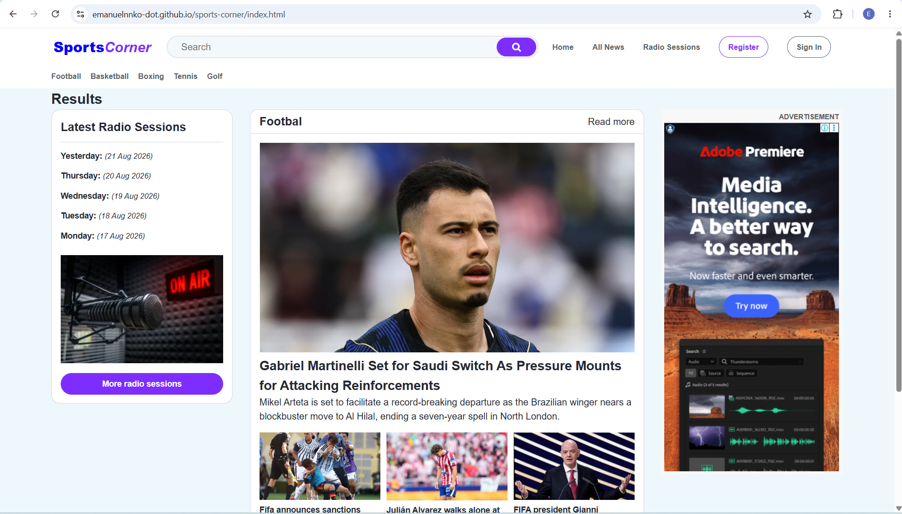

# Sports Corner
## Who we are
The Sports Corner is the website that aims at providing current sports news from Tanzania and abroad in sports like football, basketball, boxing, tennis, golf etc.
The website was established as the way of engaging with sports funs through web platform.

## Problem statement
This website is created based on the imaginary problem that can be narrated as follows:
*The client is the producer of a certain sports program called “Sports Corner” that is aired on radio. Due to the time limit of just 30 minutes to air their program while they want to provide more information to their listeners, they now want another platform (website) on which they can put more information out there and their listeners would consume on their demand whenever they need. Although there is social media where they could share their information, but they want the platform that can give them flexibility based on what they want to offer and on top of that they want that platform to be used as another source of income by showing advertisements.*
- Based on current situation, their listeners are not able to listen to them when they missed the on-air session.
- Due to time limit they can’t give much information on radio
- They are in need of another source of income.

## Solution
To create the website that will include the features that will meet their needs. The website should be well designed with intuitive features. It should also having good performance and linked with major online Ads. Distributors especially Google AdSense.

## Current features
-  Sports news form different categories like football, basketball, boxing, tennis, golf etc.
-  Demonstration of how the register page is look like.
-  Demonstration of how the log in page is look like.

## Future improvements
-  Improve the design of the web page with interactivity features with ### 1. JavaScript.
-  Create functionality of listening recorded radio program.
-  Creating features to allow users to react on news like commenting, like and share.
-  Adding Google AdSense service to the website for advertisement.

## Technology
-  HTML – For content and structure of the web pages.
-  CSS – For styling of web pages.
-  Font awesome – For using icons on the web pages.
-  Git and GitHub – For source control, managing repositories and share repositories.
- ChatGPT – For generating customized images.


### File structure
```
sports-corner
  images
    ads
    football
    team
  about.html
  all-news.html
  contact.html
  index.html
  login.html
  README.md
  register.html
  stylesheet.css

```
### Installation and setup
Check the link below to run the project

git clone
```
https://github.com/emanuelnnko-dot/sports-corner.git
```
**Copy the link** and ***paste on web browser*** to reach to the project repository on gitHub

### How the project looks like
This is the home page


### Contribution and collaboration 
It's okay to contribute and collaborate on this project, just follow the steps below:

1. Clone the project

git clone
```
 https://github.com/emanuelnnko-dot/sports-corner.git
```
2. Make a pull request
3. Document the contribution as an issue

### License 
The project is under MIT license and the author is @emanuelnnko-dot